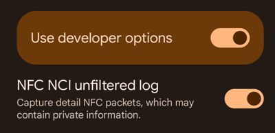

NFC-SNOOP-DOGG
==============


Live monitoring of Android `NFCSNOOP` packets via USB or wireless debugging.

Captures low-level NFC controller interface (NCI) data. Root not required.

Make sure to enable unfiltered NFC logging in developer options.

Thanks to [@rileyg98](https://github.com/VivoKey/NFCSnoopDecoder) and [@snake-4](https://github.com/snake-4/NFC-NCI-Decoder) for making this possible!

This project is free and open-source software.

Usage Instructions
------------------

1. [Download](https://github.com/VivoKey/nfc-snoop-dogg/releases/download/v1.0.0/nfc-snoop-dogg.apk) and install the APK file:
   ```shell
   adb install nfc-snoop-dogg.apk
   ```

2. Enable **NFC NCI unfiltered log**:

   

3. Execute the following command to start capturing live NFC packets:
   ```shell
   adb shell "content read --uri content://nfcsnoop | sh"
   ```

